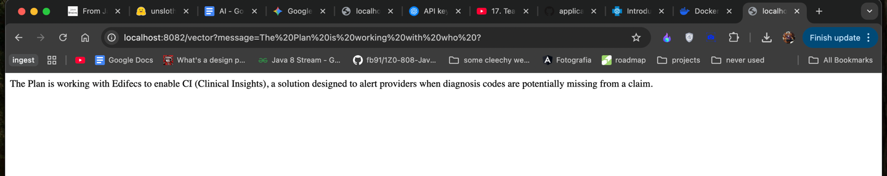

# My handshake with AI using my home language java

his is a simple Java app that talks to a local LLM running on my laptop. I didn't want to use Python, so I figured out how to do it all in Java with **LangChain4j** and **Ollama**.

It's actually running a 1B Llama model (the Q8 version, so it's smart but tiny)

## 🛠 Tech Stack
* **Java 21** 
* **LangChain4j** - Basically the "Spring Data" for AI stuff.
* **Ollama** - The thing that runs the actual model in the background.
* **Model:** Llama 3.2 1B (Instruct) in `.gguf` format.

## 🚀 How to set this up

### 1. Get Ollama
First u need [Ollama](https://ollama.com). Just download the Mac app and let it run in the background. You don't really need the terminal for running it later, just keep the app open.

### 2. The Model (The tricky part)
I didn't use the default model because I wanted the high-quality one (Q8_0).

1.  **Download the GGUF file:**
    I grabbed `Llama-3.2-1B-Instruct-Q8_0.gguf` from Hugging Face. It's like 1.3GB.

2.  **Make a Modelfile:**
    In the folder where you saved the gguf, make a file called `Modelfile` (no extension) and put this line in it:
    ```dockerfile
    FROM ./llama-1b.gguf
    ```
3.  **Register it in Ollama:**
    Run this in your terminal:
    ```bash
    ollama create java-brain -f Modelfile
    ```
    I named it `java-brain` i mean why not.

## 📦 Code Setup
### Maven Dependencies
Put this in your `pom.xml`. google them, pretty basic stuff

### What all is baby step
1.  I have streaming sample
2. I also have chat Template configured

### play with spring boot
* **`@AiService`**: To create a declarative AI interface.
* **`@Tool`**: To let the AI call my Java methods.
* **`@V`**: To inject variables into prompt templates (e.g., `Hello {{name}}`)
*  I ended up paying $5 for an OpenAI API key.
* Switched from `OllamaChatModel` to `OpenAiChatModel` because the local LLM was behaving quite dumb to be honest !


### Vector Database integration
* Used a global url to feed data and store it in a vector database after embedding
* Creating the chatClient with that data as context
* Getting the required answer
* 